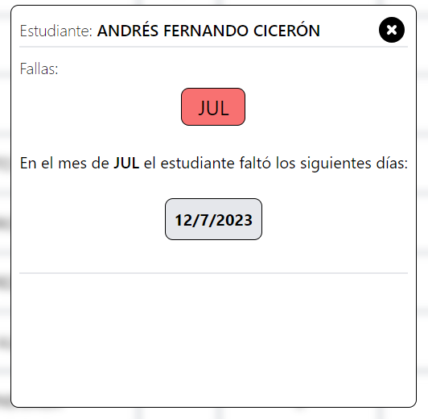

# | Llevar el control de asistencia

## Poner fallas

Para poner una falla, tendrás que hacer click sobre la casilla en blanco en la columna de "Fallas", y, cuando lo hagas, aparecerá una "X". Para quitar la falla, sólo tienes que volver a hacer click en la casilla donde está la "X".

<figure><figcaption>
Lista con fallas
</figcaption></figure>

## Poner excusas

En la columna "Excusa", podrás escribir la excusa del estudiante. Se recomienda que la excusa sea breve y concisa.

<figure><figcaption>
Lista con fallas y excusas
</figcaption></figure>

## Ver el historial del estudiante

Haciendo click sobre el nombre de cualquier estudiante lo llevará a una ventana en donde verá sus fallas y excusas, estas estarán en 2 secciones diferentes, en donde se podrán ver los meses en donde ocurrió las fallas y/o excusas, si clicka sobre algún mes, se mostrará el historial del estudiante en ese mes específicamente.

.png>)

